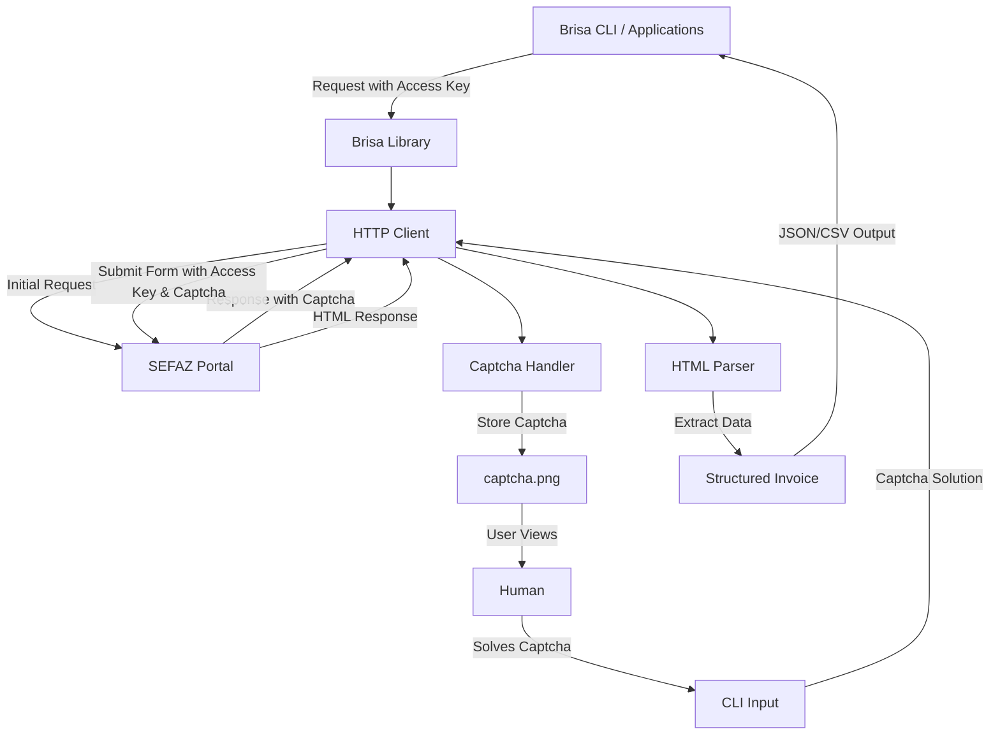

# 🌬️ Brisa - Brazilian NFC-e Invoice Extraction Library

Brisa is a Go library for retrieving and parsing Brazilian electronic invoices
(NFC-e) from SEFAZ (State Treasury Department). It provides a simple, reliable
way to extract structured data from NFC-e invoices using their access keys.

## 🧱 Architecture Overview



## 🌟 Features

- **Data Extraction**: Retrieve invoice details including items, prices, merchant info, and tax data
- **Structured Data**: Convert raw HTML responses into clean, well-structured Go objects for easy consumption
- **Error Handling**: Comprehensive error types for different failure scenarios
- **Session Management**: Automatic handling of cookies and session state
- **Dual Interface**: Use as both a Go library and CLI tool

## 🚀 Installation

```sh
go get github.com/glwbr/brisa
```

## 💻 Basic Usage

As a Library

```go
package main

import (
	"fmt"
	"log"

	"github.com/glwbr/brisa"
)

func main() {
	client := brisa.New()

	// TODO...
}
```

## CLI Usage

> Subject to change

```sh
# Get invoice data
brisa fetch -k 00000000000000000000000000000000000000000000

# Get captcha image
brisa captcha -o captcha.png
```

## 🛠 Error Handling

Brisa provides typed errors for precise error handling:

```go
invoice, err := client.GetInvoice(accessKey)
if err != nil {
	switch err := err.(type) {
	case *brisa.CaptchaError:
		// Handle captcha challenge
	case *brisa.NotFoundError:
		// Handle invalid access key
	case *brisa.NetworkError:
		// Handle connection issues
	default:
		// Generic error handling
	}
}
```

## 🧑‍💻 Development

### With Nix (Recommended) ❄️

The project is managed as a Nix flake for reproducible development.

#### Prerequisites

- [Nix](https://nixos.org/download.html) installed with [flakes enabled](https://nixos.wiki/wiki/Flakes)

#### Development Environment

Enter the environment:

```sh
nix develop
```

For **direnv** users the project includes the .envrc make sure its allowed to run on the project directory:

```sh
direnv allow
```

#### Running Brisa

```sh
nix run "github:glwbr/brisa"
```

---

### Option 2: Without Nix 🛠️

For non-Nix users, manually install:

#### Prerequisites

- [Go](https://go.dev/dl/) (version specified in `go.mod`)
- Optional: `treefmt` for formatting (`https://github.com/numtide/treefmt`)

#### Build & Run

```sh
go build -o brisa . && ./brisa
```

---

## Code Formatting ✨

The project uses `treefmt` for consistent styling.

Format all code:

```sh
treefmt
```

Customize via `.treefmt.toml`. Example:

```toml
[formatter.alejandra]
command = "alejandra"
includes = ["*.nix"]
```

## 🤝 Contributing

Contributions are welcome! Please feel free to submit a Pull Request.

When contributing:

1. Fork the repository
2. Create a feature branch (`git checkout -b feature/amazing-feature`)
3. Commit your changes (`git commit -m 'Add amazing feature'`)
4. Push to the branch (`git push origin feature/amazing-feature`)
5. Open a Pull Request

## 📄 License

This project is licensed under the MIT License - see the LICENSE file for details.
